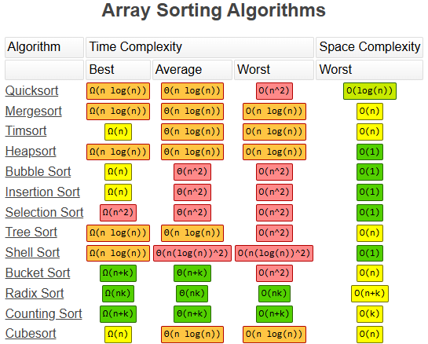
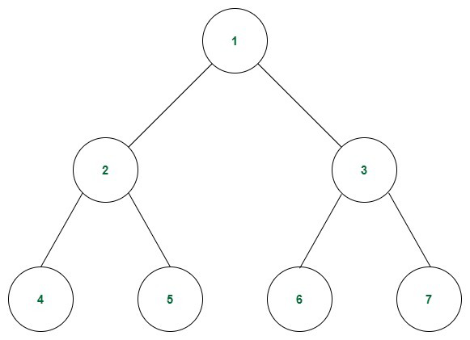

# MasterCodeInterview
Big O Notation + Data Structures + Algorithms exercises with Java

(All content here refers to the course **"Master the Coding Interview: Data Structures + Algorithms"** by Andrei Neagoie - https://www.udemy.com/share/1013ja3@Ahg-_VoZoRNnhroJCNpiaHHTGeM2xkzu7Zh7lqng98FGhNabwGjP9nefcmM4azc=/)

(The following content is a mix of course resume and some copy and paste of checklists, guides, step-by-step instructions etc - I wrote it as a way to fix better new knowledge and have a reference to read when needed)

## Big O complexity chart

## Course Mind maps
- https://coggle.it/diagram/W5u8QkZs6r4sZM3J/t/master-the-interview

## Big O Cheatsheets
- https://zerotomastery.io/cheatsheets/big-o-cheat-sheet/
- https://zerotomastery.io/cheatsheets/data-structures-and-algorithms-cheat-sheet/
- https://www.bigocheatsheet.com/

## Big O's (For time and space complexity)
- **O(1)** Constant- no loops
- **O(log N)** Logarithmic - usually searching algorithms have log n if they are sorted (Binary Search)
- **O(n)** Linear - for loops, while loops through n items
- **O(n log(n))** Log Linear - usually sorting operations
- **O(n^2)** Quadratic - every element in a collection needs to be compared to ever other element. Two nested loops
- **O(2^n)** Exponential - recursive algorithms that solves a problem of size N
- **O(n!)** Factorial - you are adding a loop for every element - it's not usual to find or apply this complexity, because it's so expensive

## Big O rules
- Worst case
  - Consider only the worst case to define the complexity of an algorithm 
    - ex: an algorithm with **O(1)** and **O(n)** operations will be **O(n)**
- Remove constants
  - Don't consider any complexity defined with a constant
    - ex: an algorithm with **O(1 + n/2 + 100)** will be **O(n)**
    - The main idea is to evaluate how the number of operations scale with the number of elements, instead of care about the number of operations to be performed
- Different terms for inputs
  - Pay attention on which terms / elements a loop or any kind of operation applies to, in order to not assign a wrong complexity notation of **O(n)**
  - Two separate collections (two separated inputs) have different variables in big O
    - When executed in order (same level): O(a + b)
    - When executed nested: O(a * b), which results in **O(n^2)** - quadratic time
- Drop non dominants
  - Consider only the most significant part
  - ex: an algorithm with **O(n^2 + 3n + 100 + n/2)** will be **O(n^2)**, because the quadratic function will always scale more than other parts
  - The best algorithm is which scale elements with the minimum increment of operations
  - Iterating through half a collection **O(n/2)** is still **O(n)**

## What can cause time in a function ?
- Operations (+, -, *, /)
- Comparisons (<, >, ==)
- Looping (for, while)
- Outside Function call (function())

## What causes Space complexity ?
- Variables
- Data Structures
- Function Call
- Allocations

## What's a good code ?
- Readable
  - Clean code
  - Maintainable
- Scalable
  - Speed: 
    - Time complexity (Big O)
    - Efficient (fewer operations as inputs grows, resulting in shorter time to run)
  - Memory
    - Space complexity (Big O)
    - Efficient (lower memory usage to complete the algorithm)

## Trade-off for good code
- Fast algorithms usually require more memory
- Low memory algorithms usually require more time

## How to Solve coding problems
- [Google interview](https://youtu.be/XKu_SEDAykw?si=iffIYjyP45qLsd5b)
- [Code](src/howToSolveCodingProblems/googleInterview/GoogleInterviewExercise.java)
- [Match 3 game exercise](src/howToSolveCodingProblems/MatrixExercise.java)

## What skills interviewer is looking for
- Analytic skills - How can you think through problems and analyze things ?
- Coding skills - Do you code well, by writing clean, simple, organized, readable code ?
- Technical knowledge - Do you know the fundamentals of the job you're applying for ?
- Communications skills - Does your personality match the companie's culture ?

## Step by step through a problem
1. First of all, watch to time window for the interview and plan how to complete all tasks and tests, leaving time for questions made by interviewer and by you
2. Always pay attention to be very quickly and straight forward, find a ideal balance between express your thoughts and knowledge without been boring or using too much time
3. When the interviewer says the question, write down the key points at the top. 
   - Make sure you have all the details. 
   - Show how organized you are
4. Make sure you double check
   - What are the inputs ? 
   - What are the outputs ?
5. What is the most important value of the problem ? 
   - Do you have time, space, memory etc ? 
   - What is the main goal ?
6. Don't be annoying and ask too many questions to the interviewer
7. Start with the naive/brute force approach. 
   - First thing that comes into your mind. 
   - It shows that you're able to think well and critically (you don't need to write this code, just speak about it).
8. Tell them why this approach is not the best (i.e. O(n^2)) or higher, not readable etc...
9. Walk through your approach, comment things and see where you may be able to break things. 
   - Any repetition, bottlenecks like O(n^2), or unnecessary work ? 
   - Did you use all the information the interviewer gave you? 
   - Bottleneck is the part of the code with biggest Big O. Focus on that. Sometimes this occurs with repeated work as well.
10. Before you start coding, walk through your code and write down the steps you are going to follow
11. Modularize your code from the very beginning. 
    - Break up your code into beautiful small pieces and add just comments if you need to.
12. Start actually writing your code now. 
    - Keep in mind that the more you prepare and understand what you need to code, the better the whiteboard will go.
    - So never start a whiteboard interview not being sure of how things are going to work out. That is a recipe for disaster.
    - Keep in mind - A lot of interviews ask questions that you won't be able to fully answer on time.
    - So think: what can I show in order to show that I can do this and I am better the other coders.
    - Break things up in functions, methods etc (if you can't remember a method, just make up a function and you will at least have it there. Write something, and start with the easy part)
13. Think about error checks and how you can break this code.
    - Never make assumptions about the input 
    - Assume people are trying to break your code and that Darth Vader is using your function.
    - How will you safeguard it ?
    - Always check for false inputs that yo don't want.
    - Here is a trick: 
      - comment in the code, the checks that you want to do... 
      - write the function, 
      - then tell the interviewer that you would write tests now to make your function fail (but you won't need to actually write the tests)
14. Don't use bad/confusing names like i and j for variables, instances etc - write code that reads well
15. Test your code: Check for no params, 0 undefined, null, massive arrays, async code etc... 
    - Ask the interviewer if we can make assumption about the code
    - Can you make the answer return an error ?
    - Poke holes into your solution. Are you repeating yourself ?
16. Finally talk to the interviewer where you would improve the code. 
    - Does it work ?
    - Are there different approaches ?
    - Is it readable ?
    - What would you google to improve ?
    - How can performance be improved ?
    - Possibly: Ask the interviewer what was the most interesting solution you have seen to this problem
17. If your interviewer is happy with the solution, the interview usually ends here.
    - It is also common that the interviewer asks you extension questions, such as how you would handle the problem if the whole input is too large to fit into memory
    - or if the input arrives as a stream
    - This is a common follow-up question at Google, where they care a lot about scale.
    - The answer is usually a divide-and-conquer approach - perfom distributed processing of the data and only read certain chunks of the input from disk into memory, write the ouput back to disk and combine them later.

## Good code checklist
- [✅]It works
- [✅]Good use of data structures
- [✅]Code Re-use/ Do Not Repeat Yourself
- [✅]Modular - makes code more readable, maintainable and testable
- [✅]Less than O(N^2). We want to avoid nested loops if we can since they are expensive. Two separate loops are better than 2 nested loops
- [✅]Low Space Complexity --> Recursion can cause stack overflow, copying of large arrays may exceed memory of machine

## Heurestics to ace the question
- [✅]Hash Maps are usually the answer to improve Time Complexity
- [✅]If it's a sorted array, use Binary tree to achieve O(log N). Divide and Conquer - Divide a data set into smaller chunks and then repeating a process with a subset of data. Binary search is a great
example of this
- [✅]Try Sorting your input
- [✅]Hash tables and precomputed information (i.e. sorted) are some of the best ways to optimize your code
- [✅]Look at the Time vs Space tradeoff. Sometimes storing extra state in memory can help the time. (Runtime)
- [✅]If the interviewer is giving you advice/tips/hints. Follow them
- [✅]Space time tradeoffs: Hastables usually solve this a lot of the times. You use more space, but you can get a time optimization to the process. In programming, you often times can use up a little bit more space to get faster time

## Common Data Structure Operations

## Array Sorting Algorithms

## Data Structures Map
- (Use for quick view of pros and cons of each data structure and their applications)
- 
- [PDF version](DataStructuresMindMap.pdf)
- [Original](https://coggle.it/diagram/W5E5tqYlrXvFJPsq/t/master-the-interview-click-here-for-course-link)

## Data Structures
- List of existing data structures: https://en.wikipedia.org/wiki/List_of_data_structures

## Arrays
- Time complexity:
  - Insertion - O(n) - needs to traversal the collection to shift the index of existing items
  - Insertion on end - O(1)
  - Lookup - O(1)
  - Deletion - O(n)
  - Deletion on end - O(1)
  - Search - O(n)
- Definition:
  - https://en.wikipedia.org/wiki/Array_(data_type)
  - One of most common data structures used in technical interviews
  - Collection / sequence of indexed data
  - Ordered
  - Static - fixed size and memory allocation
  - Dynamic - non fixed size and dynamic memory allocation (ArrayLists in Java)
- On Java:
  - int[] arr = new int[]{1,2,3}
  - arr.length
  - Transform in a list to manipulate and then get back to static array
  - Sorting: Arrays.sort(arr) | Arrays.sort(arr, Comparator.comparing(String::toString).reversed())
  - Reverse a string(array of chars): StringBuilder output = new StringBuilder(input).reverse().toString();
  - Merge two arrays: Collections.addAll(arraylist, array1); Collections.addAll(arraylist, array2); arrayList.toArray();
  - https://www.baeldung.com/java-arrays-guide
  - https://www.baeldung.com/java-reverse-string
  - https://www.baeldung.com/java-concatenate-arrays

## Hash tables
- Time complexity:
    - Insertion - O(1)
    - Lookup - O(1)
    - Deletion - O(1)
    - Search - O(1)
- Definition:
  - https://en.wikipedia.org/wiki/Hash_table
  - One of most common data structures used in technical interviews
  - It's an associative array, also called a dictionary or simply map
  - Associative array is an abstract data type that maps keys to values
  - Unordered
  - Dynamic
  - The hash function (implemented in every language / platform that has this data structure)
    - Calculates a hash code from a key and use it as a key in the hash table
    - The memory address is generated by converting the generated hash code into a memory address
    - Stores the value and the key in the selected memory space in hash table
    - There is a lot of hash algorithms (md5, sha-1, sha-256 etc)
    - It's a one way algorithm, it's almost impossible to retrieve the key value from the generated hash code
    - The generated hash has the same value and a fixed length for the same key (idempotent)
    - Usually all languages implements a optimized hash function, in a way that we can consider always calling this function as a constant O(1) time complexity 
  - Hash collisions:
    - https://www.cs.usfca.edu/~galles/visualization/OpenHash.html
    - The collision occurs when the calculation of memory address results in a already used one (imperfect hash function)
    - In this case the space in memory address is converted to as linked list, allowing to store more than one value
    - When the same memory address stores multiple values, then lookup and search operations become O(n)
    - To solve this problem the hash function implementations has an algorithm for collision resolution, usually applying the separated chaining or open addressing methods
      - Separate chaining: consists in build a linked list with key-value for each array index, allowing to retrieve a value by it's key in O(1) time complexity
      - Open addressing: https://en.wikipedia.org/wiki/Open_addressing
- Implementations examples in package [src/dataStructures/hashtables](src/dataStructures/hashtables)
- Important tips:
  - Unordered data structure
  - Slow key iteration (if needed to grab all the keys)
  - Has the tradeoff of using more memory (space complexity O(n))
  - Usually applied to improve time complexity from quadratic O(n^2) to linear O(n), due to reduce nested loop to only one loop, for example

## Trees
- Definition:
    - https://en.wikipedia.org/wiki/Tree_(abstract_data_type)
    - Hierarchical tree structure with a set of connected nodes. Each node can be connected to many children, but must be connected to exactly one parent, except for the root node.
    - These constraints mean there are no cycles or loops in the tree.
    - Each child node can be treated like the root node of its own subtree
    - Recursion is a useful technique for tree traversal
    - Tree it's a abstract data structure
    - There is many different tree types - Look at Trees section at [Wikipedia](https://en.wikipedia.org/wiki/List_of_data_structures)

## Binary Tree

- Time complexity:
    - Insertion - O(log N)
    - Lookup - O(log N)
    - Deletion - O(log N)
- Definition:
    - https://en.wikipedia.org/wiki/Binary_tree
    - Each node can have either zero, one or two child nodes
    - Each child can only one parent
    - There is two types of binary tree:
      - Perfect binary tree: when all nodes are defined with left and right child
      - Full binary tree: when one or more nodes have zero or left and right child
    - The perfect binary tree is the most desirable and efficient tree, with the following properties:
        - The number of total nodes doubles as we move down the tree
        - The number of nodes on the last level equals the number of nodes on previous nodes plus 1
    - This means that the half of nodes are on the last level, which brings efficiency while searching for something
    - Explanation about the time complexity O(log N) for lookup:
      - log N is the representation of the number of steps to find an element, based on the number of nodes in the binary tree
      - definition for logarithm - https://en.wikipedia.org/wiki/Logarithm
      - example: 
        - to find the element 5, there is 3 steps to follow traversing the tree: 1 > 2 > 5
        - (there is no other path to reach the element 5)
    - Based on this properties, binary tree it's a very optimized data structure when talking about lookup

## Binary Search Tree (BST)

- Time complexity:
    - Insertion - O(log N)
    - Lookup - O(log N)
    - Deletion - O(log N)
- Definition:
    - https://en.wikipedia.org/wiki/Binary_search_tree
    - [Visual binary search tree](https://visualgo.net/en/bst)
    - Ordered
    - Flexible size
    - Very optimized for searching and comparing elements
    - This data structures preserves relationships between elements (ie a list of files each in a different folder)
    - Rules:
      - All child nodes to the right of root node must be greater than parent node
      - All child nodes to the left of root node must be lower than parent node
      - A node can have up to 2 child nodes (left and right)
    - This rules result in a very optimized lookup algorithm, for example to find the element 3 the algorithm verify from the root node:
      - 4 is greater than 3 ? Yes, so move to the next element in the left
      - 2 is greater than 3 ? No, so move to the next element right
      - Found the 3 element
    - Balanced vs Unbalanced:
      - A balanced BST is a tree with all nodes (left and right)
      - A unbalanced BST is a tree with uncompleted nodes (left or right only)
    - A unbalanced BST results in a worse time complexity of linear O(n), because to lookup, insert or delete an element it's needed to traversal the unbalanced tree element by element

## DataStructure ?
- Time complexity:
    - Insertion - ?
    - Lookup - ?
    - Deletion - ?
    - Search - ?
- Definition:
    - (link to wikipedia)
    - ?
- Implementations examples in package [src/dataStructures/?](src/dataStructures/?)
- Important tips:
    - ?

## Algorithms
- Sequence of steps / instructions to execute some task and get some results
- Applying the most appropriate algorithm the time and space complexity can be optimized, usually O(n), O(log n) or O(1), linear

## Recursion
- It's more about a technique than about an algorithm
- Occurs when a function calls itself
- Can cause a call stack overflow if not implemented properly, due to memory allocation to control calls
- To help decide when to apply recursion, consider the following:
  - Identify the recursive case (point where recursion starts)
  - Identify the base case (point where recursion is controlled / conditioned / stopped)
- In the [Factorial](src/algorithms/recursion/Factorial.java) case both approaches (iterative and recursive) result in same time complexity
- In the [Fibonacci](src/algorithms/recursion/Fibonacci.java) case:
  - The recursive version results in a O(n^2) time complexity, which is very bad
  - In this case the interactive version is much better, because it's linear, a O(n) time complexity
- When to use recursion:
  - Every time you are using a tree or converting something into a tree consider recursion
    - Divided into a number of sub problems that are smaller instances of the same problem
    - Each instance of the sub problem is identical in nature
    - The solutions of each sub problem can be combined to solve the problem at hand
  - Divide and conquer using recursion
- Using recursion can turn code more readable, but pay attention to the increase of cost in time complexity
- Anything you do with a recursion can be done iteratively (loop)
